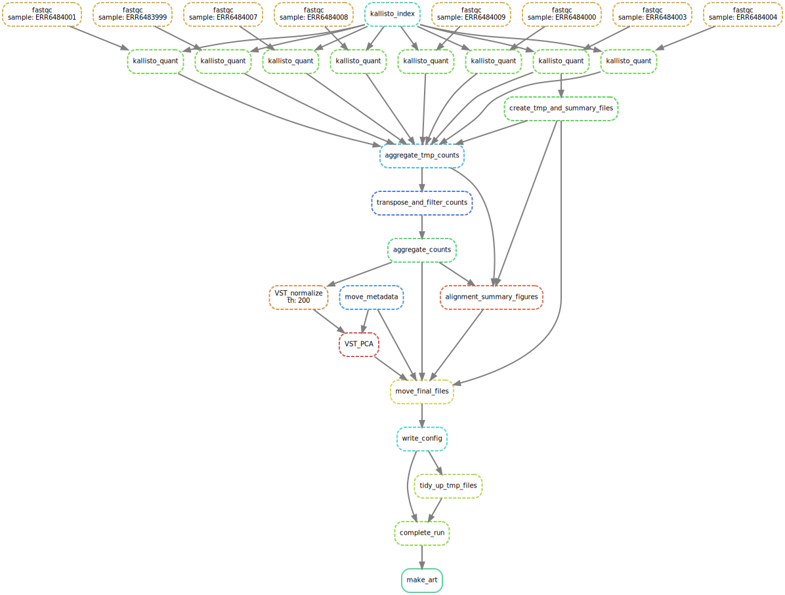

# Creating a Kallisto_Snakemake pipeline for single-read RNA-Seq

## Overview

A Bioinformatics project to show that I can create basic NGS pipeline using some
common bioinformatics tools like bioconda, snakemake, python and R.

[Snakemake](https://snakemake.readthedocs.io/en/stable/) pipeline which takes a
transcriptiome fasta file and singe-read RNA-Seq fastq files and create counts
tables using [Kallisto](https://pachterlab.github.io/kallisto/about). 
Strictly speaking Kallisto does not align reads it pseudoaligns them using
fancy matching so doesn't produce a BAM or anything I can use to do varaint 
calling or anything like that. Kallisto was used since it works well on a laptop.

Once a counts table is produce the snakemake pipeline will then create 
some basic QC plots showing the porportion of reads pseudoaligned and 
a PCA with the samples coloured by a experimental variable found in the 
metdata. Along with .png and .svg files for the figures, plotly wedgits made 
with the [plotly r]() package will also be produced which can be added
to a [quarto]() or [streamlit]() report at some point.

There is no particular reason for a NGS pipeline to create little 
art works but I really just made this to practice stringing 
python, R and shell togtheir in a automation pipeline that 
scale with additional cores. There is a few things to add like 
creating additional summary tables of the FASTQC reports of 
each of the samples and it would be good to adapt the 
pipeline for parired-end reads. Am not currently 
adding to the snakemake pipeline.


## Running the Snakemake 

Once cloned the repo contains configs and metadata for two 
test runs on maize and rat data. To download the rest of the
data, FASTQ reads and FASTA transcriptomes, run the two
shell scripts in the scr/ folder.

```

src/download_exampleA.sh
src/download_exampleB.sh

```

Download snakemake and mamba. Mamba is used
to quickly download the other programs and 
R pcakages in conda enviroments.

```
conda install snakemake mamba 

```
Once snakemake and mamba are installed and
added to path its time to run the sankemake pipeline 

```


# create a working directory 
# same path as the working directory in the config

mkdir test/exampleA

# before running the full snakemake 
# try creating a DAG figure and 
# rulegraoh figure to check the rules 
# and config file are working corrrectly 


snakemake -s src/snakefile.smk \
--config-file data/configs/configA.yaml \
-c1 -DAG test/exampleA/done/art.done | dot \
-tsvg > figures/testA_DAG.svg

snakemake -s src/snakefile.smk \
--config-file data/configs/configA.yaml \
-c1 --rulegraph test/exampleA/done/art.done | dot \
-tsvg > figures/testA_rules.svg

```

If the DAG and rule graph figure looks like the figures at 
the bottom of this README then the snakemake is 
good to go. Using 1 core the full pipeline 
will take around a hour. 

```

snakemake -s src/snakefile.smk \
--config-file data/configs/configA.yaml \
-c1 --rulegraph test/exampleA/done/art.done | dot \
-tsvg > figures/testA_rules.svg


```

## Example figures 



* 8 FASTQ samples pseudoaligned to maize transcriptome *


