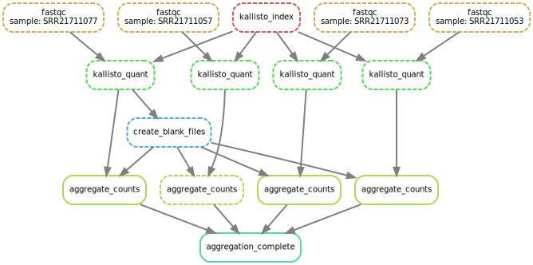

# Creating a Kallisto Snakemake pipeline for single-read RNA-Seq

## Overview 

A Bioinformatics project to show that I can create basic NGS pipeline using some
basic bioinformatics tools like bioconda, snakemake, python and R.

The focus on the project is a snakemake pipeline which takes a 
transcriptiome fasta file and set of singe-read RNA-Seq fastq files 
and produces a counts table, or 'estimated counts' as this has to be in kallisto
in order to run on my laptop.

Once the estimated counts are produced for all the RNA-Seq samples and paced
into a single counts table, the pipeline will then run some Rscripts to 
first normalize the counts using different normalization methods in the DeSeq2
package and then create some PCA plots. In order for the PCA plots to make
sense the counts table will be loaded along with a metadata table with at least
one experimental variable 

Another thing to consider is the size of the eventual counts table. The maize
transcriptiome downloaded from ensembl has over 72,000 targets. The practice 
dataset is only 8 samples but it would like this to scale to about 400 samples.
It would be hard to load a 72,000 X 400 table into a R enviroment and would 
be even harder to run something like rlog normalization on a table that size
also. So the counts table need to be filtered quite a bit before loading into
R. The pipeline will have four different thresholds for filtering out low expressed
genes instead of one since I'm intreasted in how different filtering and normalization
methods could effect the PCAs. 


## Skills used in this project 

### Linux and Shell 

### Pyhton


### R


### BioConda and BioConductor 


### Scaling for a AWS


### Virutal enviroments for reproducability 

### Interative figures made using plotly by Dash 

## What Stage is the project at now?

At the current time of writing (29/11/2022) the main branch contains a 
snake make that can takes a config file with paths to single-read RNA-Seq
fastq and a fasta transcriptome and produce a kallisto estimated counts table.
The snakemake graph below shows how the rules work in parallel.

There some major issues with this version though. If the user sets 
cores above 1 then the there is a chance that when the counts are 
beining aggreagted that two different ptyhon scripts will write to the 
same file at the same time and lead to a error. This was due to a 
lack of understadning on my part with how python locks files while 
using them. 

Other issue would be like of conda intergation so you will need to run 
the snakemake from the inside of a conda enviroment that has installed 
the two bioinformatic programs () and the python modules.





## Finding test datasets 


## Creating the yaml 


## Usage

```
# download dependencies using conda
conda env create -f environment.yml 

# activate the conda enviroment to add dependencies to path
activate snakemake_env


# run the snakemake 
snakemake -c1 -s src/Snakefile \
test/RunA_Maize/done/all_counts_moved.done


# run this if you want a nice figure
snakemake -c1 --dag -s src/Snakefile \
test/20221020_Celegans/output/done/all_counts_moved.done | dot -Tsvg > \
figures/dag.svg

# looks like it will work

snakemake -c1 --use-conda --dag --configfile data/configs/ConfigA.yaml \
-s src/Snakefile test/RunA_Maize/tables/counts_filtered_medi100.csv | dot -Tsvg > \
figures/maize_dag.svg

snakemake -c1 --use-conda --configfile data/configs/ConfigA.yaml \
-s src/Snakefile test/RunA_Maize/tables/counts_filtered_medi100.csv 


snakemake -c1 --use-conda -s src/Snakefile \
test/RunA_Maize/done/tidy_up.done

```

## Development diary 

### 2022_12_03

When running Rscripts I will need a R conda environment 

"""
conda install -c r r-essentials


"""

### 2022_12_05

PCA works fine but a column (sample) is missing from the counts 
files. The counts files missed ERR6484003. This problem occurs in vst filtering.
Copy and paste problem in both cpm and vst filtering.


### 2022_12_04

Neither the aggregate counts or transpose counts rules can be run with 
multiple cores as they both include writing to the same file. The cores
that these rules run on can be limited using resources: writing_threads=1

For the filtering it might be best to have it multithreaded with the pool
command writing each batch into a separate dir with like tmp_filter25
with a file name filtered_155_246.csv.

New problem. The headers on the counts are fine but the 
counts seem to repeat with 36 cols. The 8 samples are repeated 9 times. 
The problem was caused be me running the snakemake 9 times with 
each repeat adding another 8 rows to tmp_counts_raw.csv.

Rscripts for vst and cpm work fine in R conda env

### 2022_11_16

Should be able to create a function that loads chunks of the tmp_counts_raw.csv
and writes them transposed into counts_raw.csv and target median filters then 
into counts_filtered_raw.csv. The counts_raw.csv is what you would use 
in deseq2 provided you had the memory to load. The counts_filtered_raw.csv 
is what the pipeline will use to create 

It might be nice to use the final results to create some art as R has a
bunch of packages for generative art. There is a package MathArt which 
can create nice art work from KD trees. What is the point of doing 
K-nearest neighbor if I'm not inferring something with my data though?
Since im limited to my laptop right now I haven't tackled any data sets 
large enough to justify nonlinear modelling. It could be done 
trying to predict the experimental condition using leave one out validation. Would be cool to 
to see how different normalization methods (cpm, vst, rlog) preform especially


### 2022_11_15

Once all the counts are moved to tmp_counts_raw.csv the counts table will be transposed 
in batches using python script producing the counts_raw.csv file. 

This is also when filtering should happen. Taregts with a mean count less then 20 should 
be excluded from filtered_counts_raw.csv. How does the script i have for chunking and 
transposing even work? I need to write a function that chunks the table.


### 2022_11_14

The counts_raw.csv needs to be transposed so targets are rows and samples are columns 


### 2022_11_13

Going to add logging and conda env. Done. Snakemake checks the the 
same folder as the snakemake script for the conda first. 

What is the problem with the yamls files? Placing the line
configfile: "data/configs/ConfigA.yaml" in the Snakemake works fine but 
running the line..

```

snakemake -c1 --use-conda --dag --configfile data/configs/ConfigA.yaml \
-s src/Snakefile test/RunA_Maize/done/all_counts_moved.done| dot -Tsvg > \
figures/maize_dag.svg


```
Also works. 


### 2022_11_12

Renaming the metadata table into a sample table.
Added the metadata as a separate table.
Added new datasets and shell scripts to downloads them.
Remerging to main branch before starting work on automated figures and 
report building. 

New branch new for R


