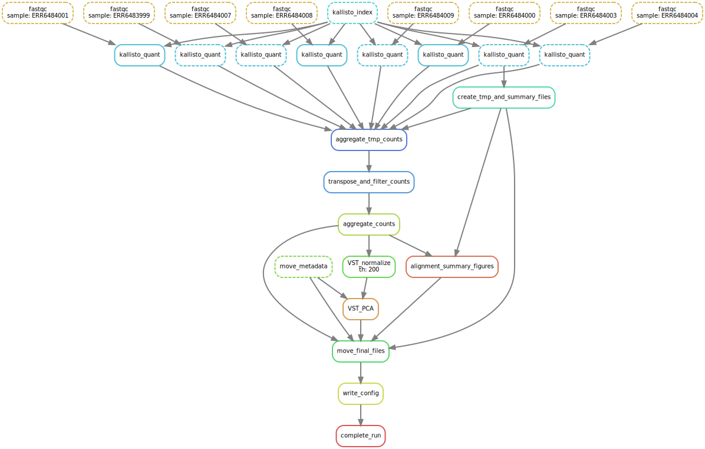

# Creating a Kallisto Snakemake pipeline for single-read RNA-Seq

## Overview 




## Finding test datasets 


## Creating the yaml 


## Usage

```
# download dependencies using conda
conda env create -f environment.yml 

# activate the conda enviroment to add dependencies to path
activate snakemake_env

# run the snakemake 
snakemake -c1 -s src/Snakefile \
test/20221020_Celegans/output/done/all_counts_moved.done


# run this if you want a nice figure
snakemake -c1 --dag -s src/Snakefile \
test/20221020_Celegans/output/done/all_counts_moved.done | dot -Tsvg > \
figures/dag.svg


```

## Updates

### 2022_11_12

Renaming the metadata table into a sample table.
Now adding the metadata as a seperate table


